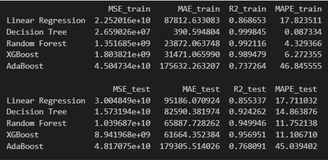
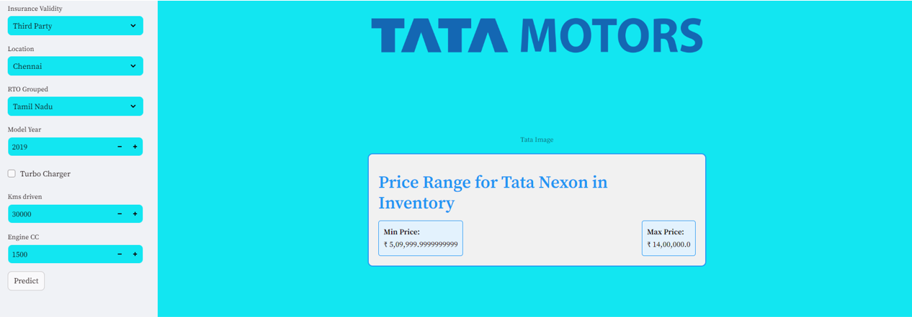

# Car Dheko - Used Car Price Prediction

## Problem Statement

### Objective
The object aim is to enhance the CarDheko customer experience and streamline the pricing process by leveraging machine learning. Requirement includes creation an accurate and user-friendly streamlit tool that predicts the prices of used cars based on various features. This tool should be deployed as an interactive web application for both customers and sales representatives to use seamlessly.

### Project Scope
We have historical data on used car prices from CarDekho, including various features such as make, model, year, fuel type, transmission type, and other relevant attributes from different cities. Your task as a data scientist is to develop a machine learning model that can accurately predict the prices of used cars based on these features. The model should be integrated into a Streamlit-based web application to allow users to input car details and receive an estimated price instantly.

## Domain
Automotive Industry

## Tools Used

- Jupyter Notebook and Pycharm - IDE
- Python - Programming
- Pandas - Data Cleaning
- Matplotlib, Seaborn - Exploratory Data Analysis
- Scikit-learn - Machine Learning
- Scipy - Optimization
- Streamlit - Visualization 

## Process flow
1.	Data Cleaning and Preprocessing
2.	Exploratory Data Analysis
3.	Machine Learning Model Development
4.	Price Prediction Techniques
5.	Model Evaluation and Optimization
6.	Model Deployment
7.	Streamlit Application Development
8.	Documentation and Reporting

## Approach

### 1)	 Data Cleaning and Preprocessing

#### a)	Import and concatenate:
i)	Import all city’s dataset which is in unstructured format.
ii)	Convert it into a  structured format.
iii)	Added a new column named ‘Location’ and assign values for all rows with the name of the respective city.
iv)	Concatenate all datasets and make it as a single dataset.
#### b)	Handled Missing Values: Identified and fill or remove missing values in the dataset.
i)	For numerical columns, used techniques like mean or median
ii)	For categorical columns, used mode imputation or labeled as 'undefined' or 'other'.
#### c)	Standardising Data Formats:
i)	Checked for all data types and did the necessary steps to keep the data in the correct format.
(1)	Eg. If a data point has string formats like 70 kms, then removed the unit ‘kms’ and changed the data type from string to integers.
#### d)	Encoding Categorical Variables: Convert categorical features into numerical values using encoding techniques.
i)	Used one-hot encoding for nominal categorical variables.
#### e)	Normalizing Numerical Features: Scale numerical features to a standard range, usually between 0 and 1.( For necessary algorithms)
i)	Apply techniques like Min-Max Scaling or Standard Scaling.
#### f)	Removing Outliers: Identify and remove or cap outliers in the dataset to avoid skewing the model.
i)	Used Z-score analysis to remove outliers.

### 2)	 Exploratory Data Analysis (EDA)

#### a)	Descriptive Statistics: Calculate summary statistics to understand the distribution of data.
i)	Mean, median, mode, standard deviation, etc.
#### b)	Data Visualization: Create visualizations to identify patterns and correlations.
i)	Used scatter plots, histograms, box plots, and correlation heatmaps.
#### c)	Feature Selection: Identify important features that significantly impact the car prices.
i)	Used techniques like correlation analysis, feature importance from models, and domain knowledge.

### 3)	 Model Development

#### a)	Train-Test Split: Split the dataset into training and testing sets to evaluate model performance.
i)	Common split ratios are 70-30 or 80-20, utilized 80-20.
#### b)	Model Selection: Choose appropriate machine learning algorithms for price prediction.
i)	Used Linear Regression, Decision Trees, Random Forests, AdaBoost and XG Boosting Machines
#### c)	Model Training: Train the selected models on the training dataset.
i)	Used cross-validation techniques to ensure robust performance.
#### d)	Hyperparameter Tuning: Optimize model parameters to improve performance.
i)	Used technique Random Search to do so.

### 4)	 Model Evaluation

#### a)	Performance Metrics: Evaluate model performance using relevant metrics.
i)	Used Mean Absolute Error (MAE), Mean Squared Error (MSE), R-squared (R2) , Mean Absolute Percentage Error (MAPE).
#### b)	Model Comparison: Compared different models based on evaluation metrics to select the best performing model.

### 5)	 Optimization

#### a)	Feature Engineering: Create new features or modify existing ones to improve model performance.
i)	Used domain knowledge and exploratory data analysis insights.
#### b)	Regularization: Apply regularization techniques to prevent overfitting.
i)	Lasso (L1) and Ridge (L2) regularization.

### 6)	 Deployment

#### a)	Streamlit Application: Deploy the final model using Streamlit to create an interactive web application.
i)	Allow users to input car features and get real-time price predictions.
#### b)	User Interface Design: Ensure the application is user-friendly and intuitive.
i)	Provide clear instructions and error handling.

## Evaluation Metrics

Best models are Random Forest and XGBoost

## Checking to see for the Lasso and Ridge Regularization

## Retrained Models with Best Parameters after hypertune

## Best Model is XGBoost with a train R2 score of 0.989 and a test R2 score of 0.956

## Link to the notebook file
You can view the full notebook with detailed analysis and code [here](./cardekho_project.ipynb).

## StreamLit Output 

## Results: 
1.	A functional and accurate machine learning model for predicting used car prices.
2.	Comprehensive analysis and visualizations of the dataset.
3.	Detailed documentation explaining the methodology, models, and results.
4.	An interactive Streamlit application for real-time price predictions based on user input.
